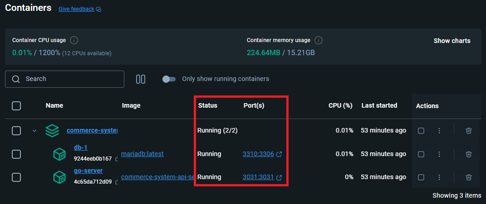
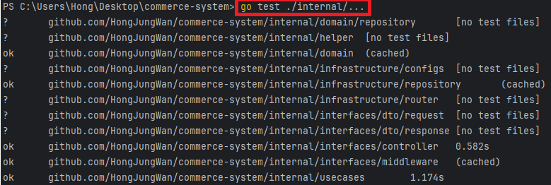
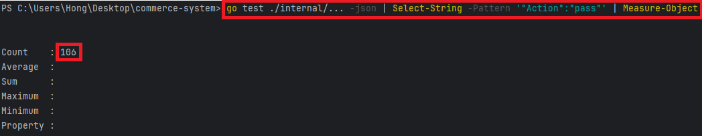
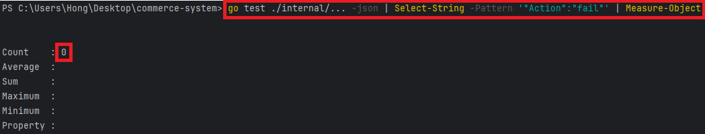
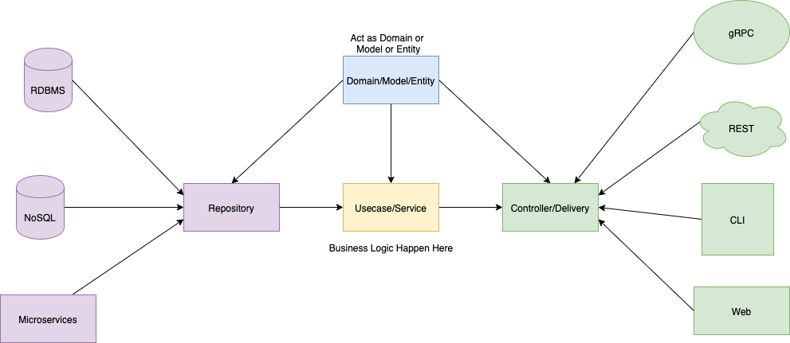
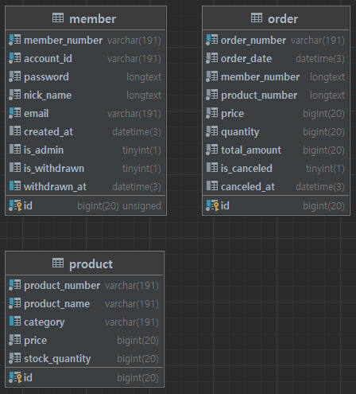

# commerce-system

<br>

### 실행 방법
1. `compose.yml` 파일이 존재하는 경로로 이동합니다.


2. `docker-compose up --build -d` 명령어를 실행합니다.


3. `Docker Desktop`에서 아래 이미지와 같이 컨테이너가 잘 실행 중인지 확인합니다.



<br><br>

### 테스트 코드 실행 시키기 (Windows Powershell 기준)

📌 **모든 테스트 코드 확인 명령어**
```
go test ./internal/...
```



<br><br>

📌 **성공한 테스트 코드 확인 명령어**
```
go test ./internal/... -json | Select-String -Pattern '"Action":"pass"' | Measure-Object
```



<br><br>

📌 **실패한 테스트 코드 확인 명령어**
```
go test ./internal/... -json | Select-String -Pattern '"Action":"fail"' | Measure-Object
```



<br><br>

### Swagger 테스트

```
swag init

go-server 컨테이너 실행 확인 후, `http://localhost:3031/docs/index.html` 접근
```

<br>

#### 예시 1️⃣, ...API

| 실행 전 UI                                               | 실행 후 UI                                               |
|-------------------------------------------------------|-------------------------------------------------------|
|  |  |

<br>

#### 예시 2️⃣, ...API

| 실행 전 UI                                               | 실행 후 UI                                               |
|-------------------------------------------------------|-------------------------------------------------------|
|  |  |

<br>

#### 예시 3️⃣, ...API

| 실행 전 UI                                               | 실행 후 UI                                               |
|-------------------------------------------------------|-------------------------------------------------------|
|  |  |


<br><br>

### Application Server Architecture



📌 [참고 Link](https://github.com/bxcodec/go-clean-arch)

<br><br>

### 폴더 구조

4개의 핵심 도메인 계층이 있습니다.

* `Models Layer`
* `Infrastructure Layer`
* `Usecase Layer`
* `Controller Layer`

<br>

```commerce-system
├── database
├── deploy
├── docs
│   ├── docs.go
│   ├── swagger.json
│   └── swagger.yaml
│
├── internal
│   ├── domain
│   │   │── repository (interface)
│   │   │   │── member_repository.go
│   │   │
│   │   │── member.go
│   │   │── member_test.go
│   │   │── ...
│   │
│   ├── infrastructure
│   │   ├── configs
│   │   ├── repository (impl)
│   │   │   │── member_repository_impl.go
│   │   │
│   │   └── router
│   │
│   ├── interfaces
│   │   ├── controller
│   │   ├── dto
│   │   └── middleware
│   │
│   └── usecases
│
├── test
│   └── fixtures
│
├── compose.yml
├── Dockerfile
├── go.mod
```

<br><br>

### ERD(Entity Relationship Diagram)



<br><br>

### API Endpoint

| HTTP Method | URI                                   | Description                             |
|-------------|---------------------------------------|-----------------------------------------|
| GET         | `/api/health`                         | 서비스 상태 확인                               |
|          |                        |                                         |
|          |                        |                                         |
| POST        | `/api/login`                          | 사용자 로그인                                 |
| POST        | `/api/members`                        | 회원 가입                                   |
| GET         | `/api/members/me`                     | 내 정보 조회, `authentication`               |
| PUT         | `/api/members/me`                     | 내 정보 수정, `authentication`                                 |
| DELETE      | `/api/members/me`                     | 회원 탈퇴, `authentication`                                   |
| GET         | `/api/members`                        | 회원 목록 조회, `authentication/authorization`                              |
| GET         | `/api/members/stats`                  | 회원 통계 조회, `authentication/authorization` |
|          |                        |                                         |
|          |                        |                                         |
| GET         | `/api/products`                       | 상품 목록 조회, `authentication`                                |
| POST        | `/api/products`                       | 상품 생성, `authentication/authorization`                                   |
| PUT         | `/api/products/:product_number/stock` | 상품 재고 수정, `authentication/authorization`                                |
| DELETE      | `/api/products/:product_number`       | 상품 삭제, `authentication/authorization`                                   |
|          |                        |                                         |
|          |                        |                                         |
| POST        | `/api/orders`                         | 주문 생성, `authentication`                                   |
| GET         | `/api/orders/me`                      | 내 주문 조회, `authentication`                                 |
| PUT         | `/api/orders/:order_number/cancel`    | 주문 취소, `authentication`                                   |
| GET         | `/api/orders/stats`                   | 주문 통계 조회, `authentication/authorization`                                |

<br><br>

### Git 커밋 메시지 규칙

| Tag        | Description                                         |
|------------|-----------------------------------------------------|
| `feat`     | 새로운 기능을 추가한 경우 사용합니다.                               |
| `fix`      | 버그를 수정한 경우 사용합니다.                                   |
| `refactor` | 코드 리팩토링한 경우 사용합니다.                                  |
| `style`    | 코드 형식, 정렬, 주석 등의 변경(동작에 영향을 주는 코드 변경 없음)한 경우 사용합니다. |
| `test`     | 테스트 추가, 테스트 리팩토링(제품 코드 수정 없음, 테스트 코드에 관련된 모든 변경에 해당)한 경우 사용합니다.                                             |
| `docs`     | 문서를 수정(제품 코드 수정 없음)한 경우 사용합니다.                                             |
| `chore`    | 빌드 업무 수정, 패키지 매니저 설정 등 위에 해당되지 않는 모든 변경(제품 코드 수정 없음)일 경우 사용합니다.                                             |

<br><br>